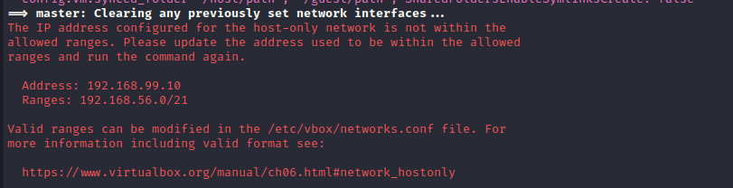
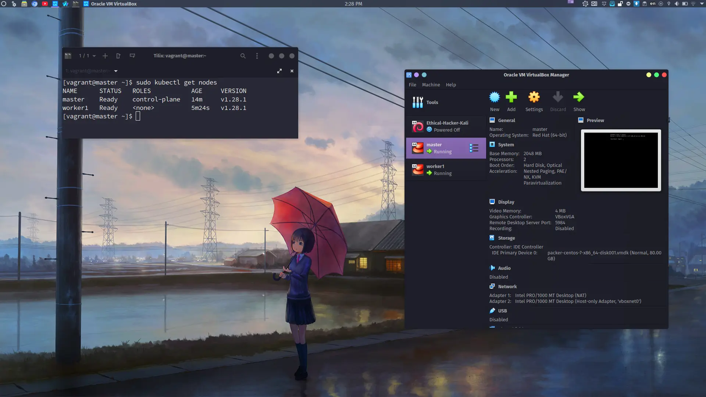

 I am working with the [kubernetes-certification-stack](https://github.com/eazytraining/kubernetes-certification-stack) repository owned by [eazytraining](https://github.com/eazytraining).

## Benefits of Local Implementation
Setting up a Kubernetes cluster with Vagrant and VirtualBox, using a master and worker node configuration, can be beneficial for several reasons:

- **Learning and Development Environment:** Using Vagrant and VirtualBox allows you to quickly set up a local environment that mirrors a production Kubernetes cluster. This can be useful for learning Kubernetes concepts, testing configurations, and developing applications that will eventually run on a production Kubernetes cluster.
- **Isolation and Portability:** Vagrant provides a way to manage virtual machine configurations as code, allowing you to define the entire cluster setup in a version-controlled configuration file. VirtualBox provides the virtualization platform, ensuring that the cluster runs in isolated environments that can be easily replicated across different machines.
- **Integration Testing:** With a local Kubernetes cluster, you can easily perform integration tests for your applications without affecting a production environment. This can be especially useful for testing how your applications interact with Kubernetes features like networking, storage, and security.

## Implementation

### Cloning the repository

```bash
git clone https://github.com/eazytraining/kubernetes-certification-stack.git
cd kubernetes-certification-stack
```
### Vagrant

#### Starting Vagrant Environment

```bash
vagrant up
```
##### Troubleshooting tips
- For best results, use these scripts with a stable internet connection.
- Even if it appears that the process is stalled, avoid canceling it.
- If the process is canceled or interrupted, delete the virtual machines and rerun the Vagrantfile.
- If you encounter the IP address configuration error depicted in the image below, create a new file at `/etc/vbox/networks.conf` and add the following lines to it:

```code
* 10.0.0.0/8 192.168.0.0/16
* 2001::/64
```


#### SSH into Vagrant Master Node
```bash
vagrant ssh master
```
#### Check Kubernetes Nodes Status
```bash
sudo  kubectl get nodes
```



## Code Explanation

### Vagrantfile
This Vagrantfile sets up a multi-node Kubernetes cluster with one master node and one worker node. Each node is configured with a base box (*geerlingguy/centos7*), a static IP address, hostname, memory, CPU, and provisioned with a shell script for installing Kubernetes.

#### Vagrant Configuration Version and Block
```ruby
Vagrant.configure("2") do |config|
  # ...
end
```
The `Vagrant.configure` method specifies the Vagrant configuration version.

#### Master Node Configuration
```ruby
config.vm.define "master" do |master|
  master.vm.box = "geerlingguy/centos7"
  master.vm.network "private_network", type: "static", ip: "192.168.99.10"
  master.vm.hostname = "master"
  master.vm.provider "virtualbox" do |v|
    v.name = "master"
    v.memory = 2048
    v.cpus = 2
  end
  master.vm.provision :shell do |shell|
    shell.path = "install_kubernetes.sh"
    shell.args = ["master", "192.168.99.10"]
  end
end
```
- The `config.vm.define` block defines a virtual machine named "master" with specific configurations.
- It specifies the base box to use (*geerlingguy/centos7*), sets up a private static IP address (192.168.99.10), and assigns the hostname "master".
- The `config.vm.provider` block configures the virtual machine provider (in this case, VirtualBox) settings such as name, memory (2048 MB), and CPUs (2).
- The `config.vm.provision` block specifies provisioning using a shell script (`install_kubernetes.sh`) with arguments "master" and "192.168.99.10".
#### Worker Node Configuration Loop
```ruby
workers=1
ram_worker=2048
cpu_worker=2
(1..workers).each do |i|
  config.vm.define "worker#{i}" do |worker|
    worker.vm.box = "geerlingguy/centos7"
    worker.vm.network "private_network", type: "static", ip: "192.168.99.1#{i}"
    worker.vm.hostname = "worker#{i}"
    worker.vm.provider "virtualbox" do |v|
      v.name = "worker#{i}"
      v.memory = ram_worker
      v.cpus = cpu_worker
    end
    worker.vm.provision :shell do |shell|
      shell.path = "install_kubernetes.sh"
      shell.args = ["node", "192.168.99.10"]
    end
  end
end
```
- This block sets up a loop to define worker nodes based on the `workers`, `ram_worker`, and `cpu_worker` variables.
- Inside the loop, each worker node is defined with similar configurations as the master node, except for the specific IP address, hostname, and name.

### install_kubernetes.sh
This script automates the setup process for a Kubernetes environment using Ansible, including installing necessary packages, and executing Ansible playbooks based on the type of node (master or worker). It also provides informative messages about the setup process and the IP address to be used for the stack.

#### Updating and Installing Packages
```bash
#!/bin/bash
yum -y update
yum -y install epel-release
```
- The script starts with the shebang line `#!/bin/bash` to indicate that it should be executed by the Bash shell.
- It then updates the system (`yum -y update`) and installs the epel-release package, which provides additional packages for CentOS/RHEL.

#### Installing Ansible and Git
```bash
# install ansible
yum -y install ansible
# retrieve ansible code
yum -y install git
```
- This part installs Ansible (`yum -y install ansible`) and Git (`yum -y install git`) on the system, which are used for configuration management and version control, respectively.

#### Ansible Playbook Execution
```bash
KUBERNETES_VERSION=1.28.1
ansible-galaxy install -r roles/requirements.yml
if [ $1 == "master" ]
then
    # ...
else
    # ...
fi
```
- This part sets the variable `KUBERNETES_VERSION` to `1.28.1` and installs Ansible roles defined in `roles/requirements.yml` using `ansible-galaxy install -r roles/requirements.yml`.
> The `ansible` command runs Ansible playbooks, which are YAML files with tasks for remote hosts, while `ansible-galaxy`  allows users to search, install, and manage roles from the Ansible Galaxy community or their own private repositories.
- It then checks the value of the first argument passed to the script (`$1`). If it is equal to "master", it executes an Ansible playbook for setting up a Kubernetes master node. Otherwise, it executes an Ansible playbook for setting up a worker node.

#### Final Steps and Outputs
```bash
# ...
echo "For this Stack, you will use $(ip -f inet addr show enp0s8 | sed -En -e 's/.*inet ([0-9.]+).*/\1/p') IP Address"
```
- Depending on whether the node is a master or worker, the script executes different steps related to Kubernetes setup.
- Finally, it outputs a message indicating the IP address to be used for the stack, based on the network interface `enp0s8`.

### role/requirements.yml
This YAML file define the dependencies or roles required for setting up a Kubernetes environment using Ansible. Each role is specified with its source (src) and version (version). When this file is used with Ansible, it instructs Ansible to download and install these roles from the specified sources (e.g., Ansible Galaxy) before executing the main playbook that uses these roles.

#### Install a Role for Pip
```yaml
- src: geerlingguy.pip
  version: "2.2.0"
```
- This block specifies the installation of the `geerlingguy.pip` role from Ansible Galaxy.
- The `src` key specifies the source of the role (geerlingguy.pip).
- The `version` key specifies the version of the role to install (in this case, version "2.2.0").

#### Install a Role for Pip
```yaml
- src: geerlingguy.containerd
  version: "1.3.1"
```
- This block specifies the installation of the `geerlingguy.containerd` role from Ansible Galaxy.
- The src key specifies the source of the role (*geerlingguy.containerd*).
- The `version` key specifies the version of the role to install (in this case, version "1.3.1").


#### Install Kubernetes
```yaml
- src: geerlingguy.kubernetes
  version: "7.1.2"

```
- This block specifies the installation of the `geerlingguy.kubernetes` role from Ansible Galaxy.
- The `src` key specifies the source of the role (geerlingguy.kubernetes).
- The `version` key specifies the version of the role to install (in this case, version "7.1.2").


